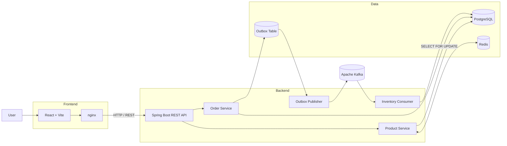

<div align="center">

# ⚡ OrderFlow

### Event-Driven Order Processing System

**Spring Boot · Kafka · PostgreSQL · Redis · Docker · Testcontainers**

<p>
  <a href="https://github.com/azim-haffar/OrderFlow/actions">
    
  </a>
  <a href="https://github.com/azim-haffar/OrderFlow">
    
  </a>
</p>

<p>
  
  
  
  
  
  
</p>

**[English](#english) · [Deutsch](#deutsch)**

</div>

---

# English

## Overview

**OrderFlow** is a full-stack, event-driven order-processing system built to demonstrate reliable backend patterns around messaging, concurrency, persistence, caching, and integration testing.

A React client submits orders through a REST API. The Spring Boot backend persists application state in PostgreSQL, records events through a **transactional outbox**, and publishes them to **Apache Kafka**. An inventory consumer processes order events while using **pessimistic database locking** to protect stock under concurrent access.

Redis provides a short-lived product cache, while the complete local system runs through Docker Compose.

### Core engineering problems demonstrated

- asynchronous event processing
- transactional consistency
- Kafka messaging
- transactional outbox
- concurrency control
- pessimistic locking
- PostgreSQL persistence
- Redis caching
- integration testing with real infrastructure
- standardized API error handling
- containerized development

---

## 📸 Preview

<div align="center">

### Dashboard


</div>

<br>

<table>
<tr>
<td width="50%" valign="top">

### Kafka Events


</td>

<td width="50%" valign="top">

### Orders


</td>
</tr>
</table>

---

## 🏗️ Architecture



### Order lifecycle

```text
POST /api/orders
        │
        ▼
Validate request
        │
        ▼
Persist order
        │
        ├────────────► PostgreSQL
        │
        ▼
Create outbox event
        │
        ▼
Commit transaction
        │
        ▼
Outbox publisher
        │
        ▼
Apache Kafka
        │
        ▼
Inventory consumer
        │
        ▼
SELECT ... FOR UPDATE
        │
        ▼
Check stock
     ┌──┴──┐
     ▼     ▼
CONFIRMED  CANCELLED
```

### Cancellation flow

```text
DELETE /api/orders/{id}
        │
        ▼
Check current status
        │
   ┌────┴────┐
   │         │
PLACED     Other
   │         │
   ▼         ▼
CANCELLED   409 Conflict
```

---

## ⚙️ Engineering Decisions

<table>
<tr>
<td width="50%" valign="top">

### 🔒 Pessimistic Locking

Inventory updates use:

```sql
SELECT ... FOR UPDATE
```

This prevents concurrent consumers from overselling the same stock.

The database row is locked while inventory is checked and updated.

</td>

<td width="50%" valign="top">

### 📬 Transactional Outbox

The order and its outbound event are committed atomically.

```text
Order transaction
      │
      ├── Order row
      └── Outbox row
```

A publisher then forwards pending events to Kafka and can retry delivery if Kafka is temporarily unavailable.

</td>
</tr>

<tr>
<td width="50%" valign="top">

### ⚡ Redis Cache

Product catalogue data is cached in Redis with a:

```text
60-second TTL
```

The implementation uses direct `CacheManager` access rather than relying on internal `@Cacheable` self-invocation.

</td>

<td width="50%" valign="top">

### 🧪 Real Integration Tests

Tests use **Testcontainers** to start real:

- PostgreSQL
- Kafka
- Redis

This keeps infrastructure-facing tests close to the actual runtime environment instead of replacing those dependencies with mocks.

</td>
</tr>
</table>

---

## 🧠 Additional Design Decisions

| Decision | Why |
|---|---|
| **Kafka KRaft** | Removes the need for a separate ZooKeeper coordination layer |
| **Transactional outbox** | Prevents a database/Kafka dual-write failure window |
| **Pessimistic locking** | Protects inventory under concurrent order processing |
| **Redis caching** | Reduces repeated product catalogue reads |
| **Denormalized `productName`** | Preserves the product name associated with the order at creation time |
| **No Lombok `@Data` on JPA entities** | Avoids problematic generated equality/hash behaviour across Hibernate associations and proxies |
| **RFC 7807 `ProblemDetail`** | Provides standardized machine-readable API errors |
| **Status-guarded cancellation** | Prevents already-processed orders from being modified inconsistently |
| **Testcontainers** | Exercises PostgreSQL, Kafka, and Redis through real containerized services |

---

## 🔄 Event-Driven Processing

The main asynchronous flow is:

```text
REST Request
     │
     ▼
Spring Boot
     │
     ▼
PostgreSQL
 + Outbox
     │
     ▼
Kafka
     │
     ▼
Inventory Consumer
     │
     ▼
Database Lock
     │
     ▼
Stock Update
     │
     ▼
Order Status
```

Possible order states include:

```text
PLACED → CONFIRMED
   │
   └────→ CANCELLED
```

---

## 🌐 API

### Products

| Method | Endpoint | Description |
|---|---|---|
| `GET` | `/api/products` | Retrieve products and current stock |
| `GET` | `/api/products/{id}` | Retrieve one product |

### Orders

| Method | Endpoint | Description |
|---|---|---|
| `POST` | `/api/orders` | Create an order |
| `GET` | `/api/orders/{id}` | Retrieve order status |
| `GET` | `/api/orders` | Retrieve recent orders |
| `DELETE` | `/api/orders/{id}` | Cancel a `PLACED` order |

### Example order

```json
{
  "productId": 1,
  "quantity": 2,
  "customerId": "customer-123"
}
```

### Error responses

The API uses standardized **RFC 7807 Problem Details**.

Typical status codes:

```text
400  Validation failure
404  Order / product not found
409  Insufficient stock or invalid order state
```

---

## 🛠️ Tech Stack

<div align="center">

### Backend


<br>

`Java 21` · `Spring Boot 3.2` · `Spring Kafka`

<br><br>

### Data


<br>

`PostgreSQL 15` · `Redis 7` · `Spring Data JPA` · `Hibernate 6` · `Flyway`

<br><br>

### Messaging


<br>

`Apache Kafka` · `KRaft`

<br><br>

### Frontend


<br>

`React 18` · `Vite 5`

<br><br>

### Testing & Infrastructure


<br>

`JUnit 5` · `Testcontainers` · `Awaitility` · `Docker Compose` · `nginx`

</div>

---

## 🧪 Testing

The backend integration tests run against real containerized infrastructure using **Testcontainers**.

### Run backend tests

```bash
cd backend
mvn verify
```

Testcontainers automatically starts:

```text
PostgreSQL 15
Apache Kafka
Redis 7
```

No manual database, Kafka, or Redis setup is required.

### Validate the frontend

```bash
cd frontend
npm ci
npm run build
```

---

## 🚀 Quick Start

### Requirements

You need:

- Docker
- Docker Compose v2

### Run the full stack

```bash
git clone https://github.com/azim-haffar/OrderFlow.git
cd OrderFlow

docker compose up --build
```

### Services

| Service | Address |
|---|---|
| Frontend | http://localhost:5173 |
| Backend | http://localhost:8080 |
| PostgreSQL | localhost:5432 |
| Redis | localhost:6379 |
| Kafka | localhost:9092 |

The full application can be started through a single Docker Compose command.

---

## 📁 Project Structure

```text
OrderFlow/
│
├── backend/
│   ├── src/
│   │   ├── main/
│   │   │   └── Java / Spring Boot application
│   │   │
│   │   └── test/
│   │       └── Testcontainers integration tests
│   │
│   └── pom.xml
│
├── frontend/
│   └── React + Vite application
│
├── docs/
│   └── screenshots/
│
├── .github/
│   └── workflows/
│       └── CI pipeline
│
└── docker-compose.yml
```

---

## 🔍 What This Project Demonstrates

OrderFlow is primarily a **backend engineering project**.

It demonstrates practical experience with:

```text
REST API design
      +
Relational persistence
      +
Asynchronous messaging
      +
Transactional consistency
      +
Concurrency control
      +
Caching
      +
Integration testing
      +
Containerization
```

The focus is not simply connecting technologies together, but understanding the failure modes and consistency problems that appear when those technologies interact.

---

# Deutsch

## Überblick

**OrderFlow** ist ein event-getriebenes Bestellverarbeitungssystem mit Fokus auf Backend-Architektur, Messaging, Datenkonsistenz, Concurrency und Integrationstests.

Ein React-Frontend sendet Bestellungen über eine REST-API. Das Spring-Boot-Backend persistiert Daten in PostgreSQL und verwendet ein **Transactional-Outbox-Muster**, um Events zuverlässig an **Apache Kafka** weiterzugeben.

Ein Inventory-Consumer verarbeitet die Events und schützt Bestandsänderungen durch **pessimistisches Datenbank-Locking**.

Redis cached Produktdaten mit einer TTL von 60 Sekunden.

---

## Architektur

```text
React
  │
  ▼
Spring Boot REST API
  │
  ├────► PostgreSQL
  │
  ├────► Redis
  │
  └────► Transactional Outbox
              │
              ▼
            Kafka
              │
              ▼
      Inventory Consumer
              │
              ▼
      SELECT FOR UPDATE
              │
              ▼
         PostgreSQL
```

---

## Technische Schwerpunkte

- Event-getriebene Verarbeitung mit Kafka
- Kafka KRaft ohne ZooKeeper
- Transactional-Outbox-Muster
- Pessimistisches Locking
- PostgreSQL + JPA / Hibernate
- Redis Cache
- RFC 7807 `ProblemDetail`
- Testcontainers
- Docker Compose
- GitHub Actions CI

---

## Wichtige Engineering-Entscheidungen

| Entscheidung | Begründung |
|---|---|
| **Pessimistisches Locking** | Schützt den Lagerbestand bei konkurrierenden Bestellungen |
| **Transactional Outbox** | Verhindert Inkonsistenzen zwischen Datenbank-Commit und Kafka-Publish |
| **Kafka KRaft** | Reduziert die operative Komplexität ohne ZooKeeper |
| **Redis Cache** | Reduziert wiederholte Datenbankzugriffe für Produktdaten |
| **Testcontainers** | Tests laufen gegen echte PostgreSQL-, Kafka- und Redis-Instanzen |
| **RFC 7807** | Einheitliches, maschinenlesbares API-Fehlerformat |
| **Status-Guard bei Stornierungen** | Verhindert inkonsistente Änderungen bereits verarbeiteter Bestellungen |

---

## Schnellstart

```bash
git clone https://github.com/azim-haffar/OrderFlow.git
cd OrderFlow
docker compose up --build
```

### Dienste

| Dienst | Adresse |
|---|---|
| Frontend | http://localhost:5173 |
| Backend | http://localhost:8080 |
| PostgreSQL | localhost:5432 |
| Redis | localhost:6379 |
| Kafka | localhost:9092 |

---

## Tests

```bash
cd backend
mvn verify
```

Die Integrationstests starten PostgreSQL, Kafka und Redis automatisch über **Testcontainers**.

---

<div align="center">

## Built by Azim Haffar

**Backend Engineering · Distributed Systems · Java / Spring Boot**

<a href="https://azimx.dev">
  
</a>

<a href="https://www.linkedin.com/in/azim-haffar">
  
</a>

<a href="https://github.com/azim-haffar">
  
</a>

</div>
