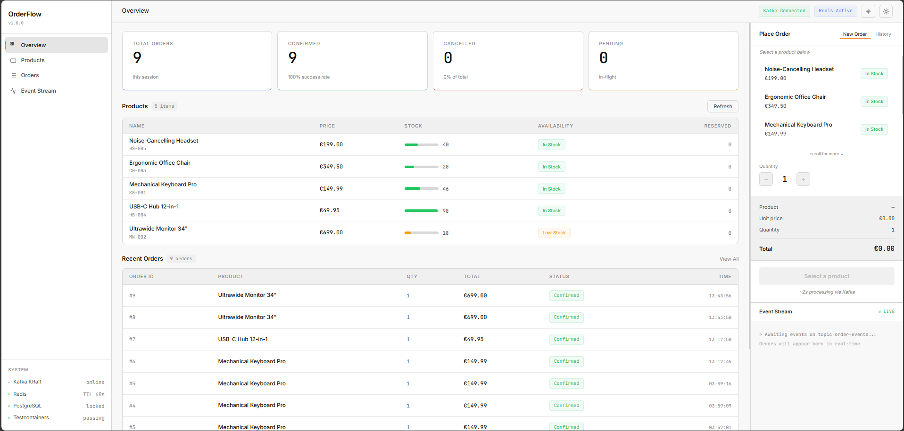
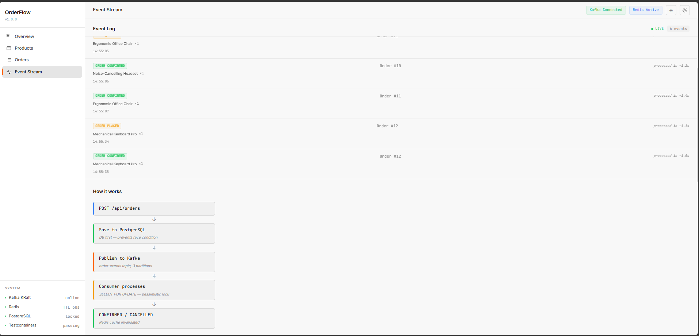
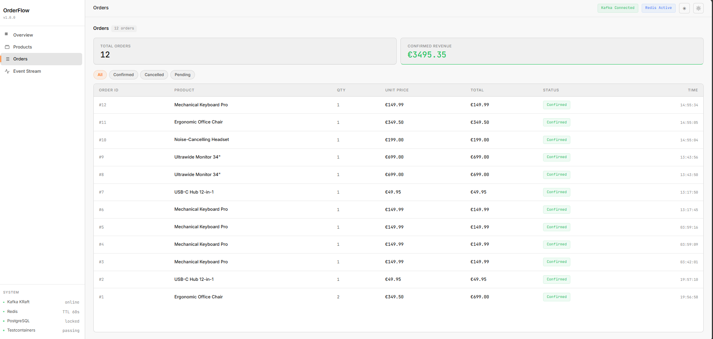
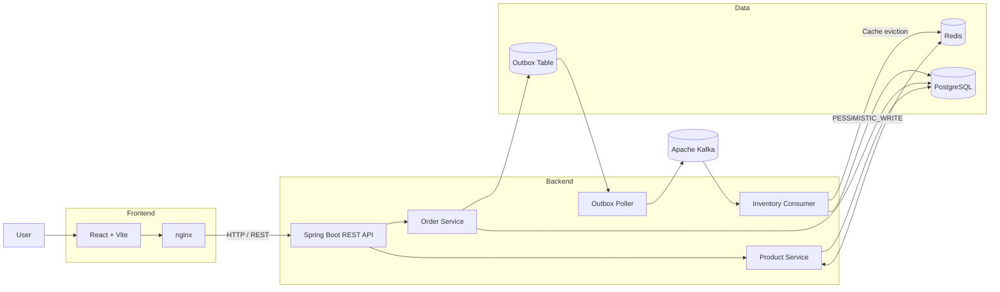

<div align="center">

# ⚡ OrderFlow

### Event-Driven Order Processing System

**Spring Boot · Kafka · PostgreSQL · Redis · Docker · Testcontainers**

<p>
  <a href="https://github.com/azim-haffar/OrderFlow/actions">
    
  </a>
  <a href="https://github.com/azim-haffar/OrderFlow">
    
  </a>
</p>

<p>
  
  
  
  
  
  
  
</p>

**[English](#english) · [Deutsch](#deutsch)**

</div>

---

# English

## Overview

**OrderFlow** is a backend-focused, event-driven order-processing system built to demonstrate reliability patterns around asynchronous messaging, transactional consistency, concurrency control, persistence, caching, and integration testing.

A React client submits orders through a REST API. The **Spring Boot** backend persists application state in **PostgreSQL**, records outbound events through a **transactional outbox**, and publishes them asynchronously to **Apache Kafka**.

An inventory consumer processes order events while using **pessimistic database locking** to protect stock from concurrent updates.

**Redis** caches product data, while **Docker Compose** runs the complete local environment including PostgreSQL, Redis, Kafka, the backend, and the frontend.

### Core engineering problems demonstrated

- asynchronous event processing
- transactional consistency
- database/Kafka dual-write handling
- transactional outbox pattern
- concurrency control
- pessimistic locking
- relational persistence
- Redis caching and invalidation
- integration testing against real infrastructure
- standardized API error handling
- database migrations
- containerized development
- automated CI

---

## 📸 Preview

<div align="center">

### Dashboard



</div>

<br>

<table>
<tr>
<td width="50%" valign="top">

### Kafka Events



</td>

<td width="50%" valign="top">

### Orders



</td>
</tr>
</table>

---

## 🏗️ Architecture



---

## 🔄 Order Lifecycle

```text
POST /api/orders
        │
        ▼
Validate request
        │
        ▼
Create order
        │
        ├────────────► PostgreSQL
        │
        ▼
Create outbox event
        │
        ▼
Commit transaction
        │
        ▼
Outbox poller
        │
        ▼
Apache Kafka
        │
        ▼
Inventory consumer
        │
        ▼
Pessimistic database lock
        │
        ▼
Check stock
     ┌──┴──┐
     ▼     ▼
CONFIRMED  CANCELLED
```

The order and its outbound event are written in the same database transaction.

Kafka publication happens afterward through the outbox poller.

---

## 📬 Transactional Outbox

Publishing directly to Kafka inside the order transaction creates a dual-write problem:

```text
Database commit succeeds
        +
Kafka publish fails
        │
        ▼
Inconsistent system state
```

OrderFlow avoids that failure window by storing the order and its event together:

```text
Database transaction
        │
        ├── Order row
        │
        └── Outbox event
                │
                ▼
             PENDING
                │
                ▼
         Outbox poller
                │
                ▼
              Kafka
                │
                ▼
            PUBLISHED
```

The outbox poller periodically reads pending events and publishes them to Kafka.

Only after a successful Kafka send is the event marked as `PUBLISHED`.

If publication fails, the event remains pending and can be processed again by a later poll.

---

## 🔒 Concurrency Control

Inventory updates use **pessimistic write locking**.

The repository acquires the product row using:

```text
LockModeType.PESSIMISTIC_WRITE
```

Conceptually, this corresponds to database behaviour similar to:

```sql
SELECT ...
FOR UPDATE;
```

The lock remains active while stock is checked and updated.

This protects inventory when multiple order events attempt to modify the same product concurrently.

```text
Consumer A ─────┐
                │
                ▼
           Product row
                ▲
                │ locked
                │
Consumer B ─────┘
        waits until lock is released
```

---

## ⚡ Redis Caching

Product reads are cached through Spring's `CacheManager` backed by Redis.

The application maintains two product caches:

| Cache | Purpose | TTL |
|---|---|---:|
| `products` | Full product list | **2 minutes** |
| `product` | Individual product lookup | **5 minutes** |

The service accesses the cache explicitly through `CacheManager`.

When inventory changes after an order is processed, the relevant product caches are evicted so later reads do not continue returning stale stock values.

```text
Inventory updated
      │
      ▼
Evict product cache
      │
      ├── products / "all"
      └── product / {id}
```

---

## 🧠 Engineering Decisions

| Decision | Reason |
|---|---|
| **Transactional outbox** | Reduces the database/Kafka dual-write failure window |
| **Kafka KRaft** | Runs Kafka without a separate ZooKeeper service |
| **Pessimistic locking** | Protects inventory during concurrent order processing |
| **PostgreSQL** | Provides transactional relational persistence |
| **Redis caching** | Reduces repeated product reads |
| **Explicit cache eviction** | Prevents stale stock data after inventory updates |
| **Flyway** | Keeps database schema changes versioned |
| **RFC 7807 `ProblemDetail`** | Provides standardized machine-readable API errors |
| **Status-guarded cancellation** | Prevents invalid modifications to already-processed orders |
| **Testcontainers** | Exercises the application against real infrastructure |
| **GitHub Actions CI** | Automatically validates backend tests and frontend builds |

---

## 🔄 Event-Driven Processing

The primary asynchronous path is:

```text
REST request
     │
     ▼
Spring Boot
     │
     ▼
PostgreSQL
 + Outbox
     │
     ▼
Outbox Poller
     │
     ▼
Apache Kafka
     │
     ▼
Inventory Consumer
     │
     ▼
Pessimistic Lock
     │
     ▼
Inventory Update
     │
     ▼
Cache Eviction
     │
     ▼
Order Status
```

Possible order states include:

```text
PLACED
   │
   ├────► CONFIRMED
   │
   └────► CANCELLED
```

---

## ❌ Cancellation Rules

Orders may be cancelled only while they remain in the `PLACED` state.

```text
DELETE /api/orders/{id}
        │
        ▼
Check current status
        │
   ┌────┴────┐
   │         │
PLACED     Other
   │         │
   ▼         ▼
CANCELLED   409 Conflict
```

This prevents already-processed orders from being modified into an inconsistent state.

---

## 🌐 API

### Products

| Method | Endpoint | Description |
|---|---|---|
| `GET` | `/api/products` | Retrieve products and current stock |
| `GET` | `/api/products/{id}` | Retrieve one product |

### Orders

| Method | Endpoint | Description |
|---|---|---|
| `POST` | `/api/orders` | Create an order |
| `GET` | `/api/orders/{id}` | Retrieve order status |
| `GET` | `/api/orders` | Retrieve recent orders |
| `DELETE` | `/api/orders/{id}` | Cancel a `PLACED` order |

### Example Order

```json
{
  "productId": 1,
  "quantity": 2,
  "customerId": "customer-123"
}
```

### Error Responses

The API uses standardized **RFC 7807 Problem Details**.

Typical responses include:

```text
400  Validation failure
404  Order or product not found
409  Insufficient stock or invalid order state
```

Example structure:

```json
{
  "type": "https://orderflow.example/errors/order-not-found",
  "status": 404,
  "detail": "..."
}
```

---

## 🛠️ Tech Stack

<div align="center">

### Backend


<br>

`Java 21` · `Spring Boot 3.2.5` · `Spring Kafka`

<br>

`Spring Data JPA` · `Hibernate` · `Bean Validation`

<br><br>

### Data


<br>

`PostgreSQL 15` · `Redis 7` · `Flyway`

<br><br>

### Messaging


<br>

`Apache Kafka` · `KRaft`

<br><br>

### Frontend


<br>

`React 18` · `Vite 5`

<br><br>

### Testing & Infrastructure


<br>

`JUnit 5` · `Testcontainers 1.19.7` · `Awaitility`

<br>

`Docker` · `Docker Compose` · `GitHub Actions` · `nginx`

</div>

---

## 🧪 Integration Testing

The backend integration tests run against **real containerized dependencies** through Testcontainers rather than replacing infrastructure with mocks.

The test environment starts:

```text
PostgreSQL 15
Apache Kafka
Redis 7
```

### Run Backend Tests

```bash
cd backend
mvn verify
```

Testcontainers handles infrastructure startup and connection configuration for the tests.

No manually configured PostgreSQL, Kafka, or Redis instance is required.

### Validate the Frontend

```bash
cd frontend
npm install
npm run build
```

---

## 🔁 Continuous Integration

GitHub Actions runs CI on:

```text
push → main
pull request → main
```

The pipeline contains two independent jobs.

### Backend

```text
Ubuntu
  │
  ▼
Java 21 / Temurin
  │
  ▼
Maven
  │
  ▼
mvn verify
  │
  ▼
Testcontainers
  │
  ├── PostgreSQL
  ├── Kafka
  └── Redis
```

Test reports are uploaded as workflow artifacts.

### Frontend

```text
Ubuntu
  │
  ▼
Node.js 20
  │
  ▼
Install dependencies
  │
  ▼
npm run build
  │
  ▼
Upload dist artifact
```

The CI pipeline verifies both the backend integration-test suite and the frontend production build.

---

## 🐳 Local Infrastructure

The complete development environment is defined in Docker Compose.

```text
Docker Compose
    │
    ├── PostgreSQL 15
    ├── Redis 7
    ├── Kafka / KRaft
    ├── Spring Boot backend
    └── React frontend / nginx
```

PostgreSQL, Redis, and Kafka include health checks, and the backend waits for its infrastructure dependencies before starting.

---

## 🚀 Quick Start

### Requirements

You need:

- Docker
- Docker Compose v2

### Clone

```bash
git clone https://github.com/azim-haffar/OrderFlow.git
cd OrderFlow
```

### Start the Full Stack

```bash
docker compose up --build
```

### Services

| Service | Address |
|---|---|
| Frontend | http://localhost:5173 |
| Backend | http://localhost:8080 |
| PostgreSQL | localhost:5432 |
| Redis | localhost:6379 |
| Kafka | localhost:9092 |

The complete system can be started with one Docker Compose command.

---

## 📁 Project Structure

```text
OrderFlow/
│
├── backend/
│   ├── src/
│   │   ├── main/
│   │   │   ├── java/com/orderflow/
│   │   │   │   ├── config/
│   │   │   │   ├── consumer/
│   │   │   │   ├── controller/
│   │   │   │   ├── dto/
│   │   │   │   ├── entity/
│   │   │   │   ├── exception/
│   │   │   │   ├── outbox/
│   │   │   │   ├── repository/
│   │   │   │   └── service/
│   │   │   │
│   │   │   └── resources/
│   │   │       └── db/migration/
│   │   │
│   │   └── test/
│   │       └── Testcontainers integration tests
│   │
│   ├── Dockerfile
│   └── pom.xml
│
├── frontend/
│   ├── src/
│   │   ├── components/
│   │   └── hooks/
│   │
│   ├── Dockerfile
│   └── package.json
│
├── docs/
│   └── screenshots/
│
├── .github/
│   └── workflows/
│       └── ci.yml
│
├── .env.example
├── docker-compose.yml
└── README.md
```

---

## 🔍 What This Project Demonstrates

OrderFlow is primarily a **backend engineering and distributed-systems project**.

It combines:

```text
REST API Design
      +
Spring Boot
      +
PostgreSQL
      +
Transactional Outbox
      +
Apache Kafka
      +
Concurrency Control
      +
Redis Caching
      +
Integration Testing
      +
Docker
      +
CI
```

The main value of the project is not simply the number of technologies involved.

It demonstrates how those technologies interact when handling concrete backend problems:

- keeping database state and outbound events consistent
- processing work asynchronously
- protecting shared inventory from concurrent updates
- managing cache freshness after writes
- enforcing valid state transitions
- standardizing API errors
- testing infrastructure-dependent behaviour
- reproducing the system through containers
- validating changes automatically through CI

---

# Deutsch

## Überblick

**OrderFlow** ist ein backend-orientiertes, event-getriebenes Bestellverarbeitungssystem mit Fokus auf **Messaging, Datenkonsistenz, Concurrency, Persistenz, Caching und Integrationstests**.

Ein React-Frontend sendet Bestellungen über eine REST-API.

Das **Spring-Boot-Backend** speichert den Anwendungszustand in **PostgreSQL**, schreibt ausgehende Events über ein **Transactional-Outbox-Muster** und veröffentlicht diese anschließend asynchron über **Apache Kafka**.

Ein Inventory-Consumer verarbeitet die Events und verwendet **pessimistisches Datenbank-Locking**, um konkurrierende Bestandsänderungen zu schützen.

**Redis** cached Produktdaten, während die vollständige lokale Umgebung über **Docker Compose** ausgeführt wird.

---

## Architektur

```text
React
  │
  ▼
Spring Boot REST API
  │
  ├────► PostgreSQL
  │
  ├────► Redis
  │
  └────► Transactional Outbox
              │
              ▼
         Outbox Poller
              │
              ▼
            Kafka
              │
              ▼
      Inventory Consumer
              │
              ▼
     Pessimistic Lock
              │
              ▼
       PostgreSQL
```

---

## Technische Schwerpunkte

- Event-getriebene Verarbeitung mit Kafka
- Kafka KRaft ohne ZooKeeper
- Transactional-Outbox-Muster
- Pessimistisches Locking
- PostgreSQL + JPA / Hibernate
- Redis Cache
- Cache-Invalidierung nach Bestandsänderungen
- Flyway-Datenbankmigrationen
- RFC 7807 `ProblemDetail`
- Testcontainers
- Docker Compose
- GitHub Actions CI

---

## Transactional Outbox

Bestellung und ausgehendes Event werden innerhalb derselben Datenbanktransaktion gespeichert.

```text
Datenbanktransaktion
        │
        ├── Bestellung
        └── Outbox Event
                │
                ▼
             PENDING
                │
                ▼
         Outbox Poller
                │
                ▼
              Kafka
                │
                ▼
            PUBLISHED
```

Dadurch wird das Risiko einer Inkonsistenz zwischen Datenbank-Commit und Kafka-Publish reduziert.

---

## Concurrency Control

Beim Aktualisieren des Lagerbestands verwendet OrderFlow:

```text
LockModeType.PESSIMISTIC_WRITE
```

Dadurch wird der betroffene Produktdatensatz während der Bestandsprüfung und -änderung gesperrt.

Mehrere konkurrierende Consumer können dadurch nicht gleichzeitig denselben Bestand verändern.

---

## Redis Cache

OrderFlow verwendet zwei Redis-Caches:

| Cache | Zweck | TTL |
|---|---|---:|
| `products` | Gesamte Produktliste | **2 Minuten** |
| `product` | Einzelnes Produkt | **5 Minuten** |

Nach einer Bestandsänderung werden die betroffenen Cache-Einträge explizit invalidiert.

---

## Wichtige Engineering-Entscheidungen

| Entscheidung | Begründung |
|---|---|
| **Transactional Outbox** | Reduziert Inkonsistenzen zwischen Datenbank und Kafka |
| **Kafka KRaft** | Kafka läuft ohne separaten ZooKeeper-Service |
| **Pessimistisches Locking** | Schützt Lagerbestand bei konkurrierenden Bestellungen |
| **Redis Cache** | Reduziert wiederholte Produktabfragen |
| **Cache-Invalidierung** | Verhindert veraltete Bestandsdaten nach Updates |
| **Flyway** | Versioniert Änderungen am Datenbankschema |
| **RFC 7807** | Einheitliches, maschinenlesbares API-Fehlerformat |
| **Status-Guard bei Stornierungen** | Verhindert ungültige Änderungen an bereits verarbeiteten Bestellungen |
| **Testcontainers** | Tests laufen gegen echte PostgreSQL-, Kafka- und Redis-Instanzen |
| **GitHub Actions** | Automatisiert Backend-Tests und Frontend-Builds |

---

## Schnellstart

```bash
git clone https://github.com/azim-haffar/OrderFlow.git
cd OrderFlow
docker compose up --build
```

### Dienste

| Dienst | Adresse |
|---|---|
| Frontend | http://localhost:5173 |
| Backend | http://localhost:8080 |
| PostgreSQL | localhost:5432 |
| Redis | localhost:6379 |
| Kafka | localhost:9092 |

---

## Tests

```bash
cd backend
mvn verify
```

Die Integrationstests starten automatisch:

```text
PostgreSQL 15
Apache Kafka
Redis 7
```

über **Testcontainers**.

---

## CI

GitHub Actions validiert Änderungen an `main` und Pull Requests gegen `main`.

Die Pipeline führt aus:

```text
Backend
  └── Java 21
      └── mvn verify
          └── Testcontainers

Frontend
  └── Node.js 20
      └── npm run build
```

---

<div align="center">

## Built by Azim Haffar

**Backend Engineering · Distributed Systems · Java / Spring Boot**

<a href="https://azimx.dev">
  
</a>

<a href="https://www.linkedin.com/in/azim-haffar">
  
</a>

<a href="https://github.com/azim-haffar">
  
</a>

</div>
