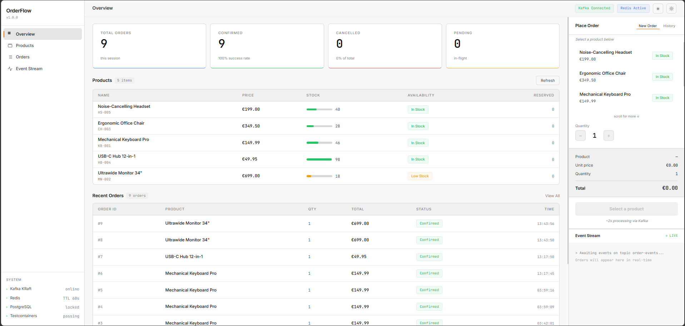
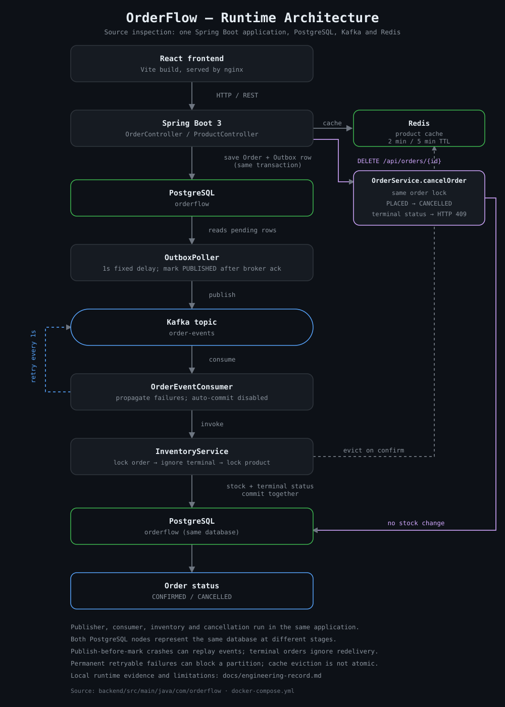
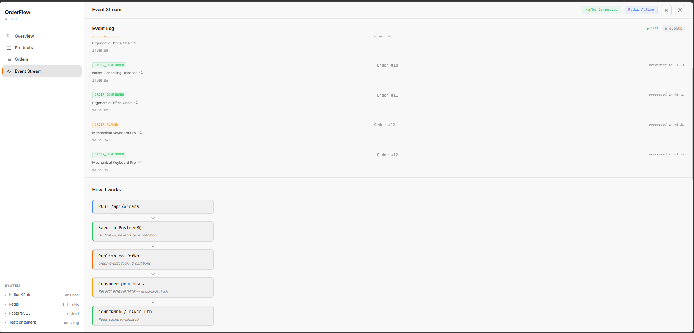
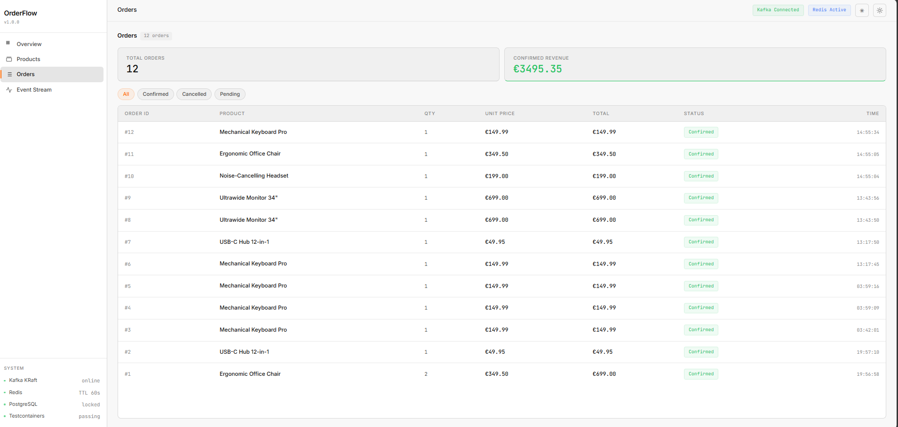

# OrderFlow


A backend engineering portfolio project for reliable asynchronous order processing, built with Java 21, Spring Boot, PostgreSQL, Kafka, Redis, and React.

[English](#english) · [Deutsch](#deutsch)

---

## English

### What it is

OrderFlow demonstrates an event-driven workflow in one Spring Boot application. A React frontend places orders through REST; PostgreSQL saves each order and its outbox event in one transaction. A scheduled publisher sends pending events to Kafka. Inventory processing locks the order, accepts only `PLACED`, then locks the product before confirming or cancelling the order. Redis caches the product list for two minutes and individual products for five minutes. The entire stack runs from `docker compose up --build`.

[Architecture and tradeoffs](docs/architecture.md) · [Reproducible demo and walkthrough](docs/demo.md) · [Verification record](docs/engineering-record.md) · [Measured Kafka failure and recovery](docs/failure-recovery.md)



### Quick Start

Prerequisites: Docker Desktop, Docker Compose v2

Native development requires Java 21 and Maven for the backend, and Node.js 22.12 or newer for the frontend.

```bash
git clone https://github.com/azim-haffar/orderflow.git
cd orderflow
docker compose up --build
```

| Service   | URL                        |
| --------- | -------------------------- |
| Frontend  | localhost:5173             |
| Backend   | localhost:8080             |
| Postgres  | localhost:5432 (orderflow) |
| Redis     | localhost:6379             |
| Kafka     | localhost:9092             |

### Architecture



_Mermaid source: [`docs/architecture/orderflow-architecture.mmd`](docs/architecture/orderflow-architecture.mmd), with a companion SVG. The diagram reflects source inspection of the Spring Boot components and Compose services. Runtime evidence is recorded separately in [the engineering record](docs/engineering-record.md). Both PostgreSQL nodes depict the same database at different stages._

Order lifecycle: POST /api/orders → order + outbox commit → Kafka publish → lock order → ignore terminal orders → lock product → stock and terminal status commit together. Delivery is **at least once**; terminal status prevents a second stock deduction for the same order.

Client cancellation takes the same order lock. If cancellation commits first, later delivery leaves stock untouched. If processing confirms first, cancellation returns 409. Retryable processing failures roll back and propagate to Kafka's one-second retry policy.



### Engineering Decisions

| Decision | Rationale |
| -------- | --------- |
| **DB save before Kafka publish** | Guarantees the row exists before the consumer processes the event. Publishing first risks a consumer reading an order ID that is not yet visible to other transactions. |
| **Order lock, then product lock** | The shared order lock serializes duplicates and cancellation. The product lock serializes stock changes across different orders. This adds waiting under contention; optimistic locking would instead require conflict retries. |
| **Direct CacheManager injection instead of @Cacheable** | Spring AOP cannot intercept self-invocation within the same bean, so @Cacheable on internal methods silently bypasses the cache. Direct injection removes the proxy dependency entirely. |
| **Kafka KRaft, no Zookeeper** | Runs the local broker and controller in one container, reducing the demo's infrastructure requirements. |
| **Denormalized productName on OrderItem** | Preserves historical accuracy. A product rename must not silently rewrite what a customer ordered; the name is captured at order time. |
| **No @Data on JPA entities** | Lombok @Data generates equals/hashCode over all fields. On Hibernate-managed proxies this causes recursive loops and LazyInitializationException under association traversal. |
| **Testcontainers with boundary fault injection** | Integration tests use real PostgreSQL, Kafka, and Redis. Spies inject cache and publish-mark failures; race tests observe actual database lock waits. Separate unit tests use mocks. |
| **Transactional Outbox Pattern** | Direct Kafka publish inside a DB transaction creates a dual-write problem — if Kafka is down, the order is saved but the event is lost. The outbox table commits atomically with the order row; a poller retries until Kafka acknowledges. |
| **Terminal status as deduplication marker** | Stock and final status commit together. Redelivery of a terminal order is ignored. This works for one processing transition per order; multiple independent event types would need a broader deduplication design. |
| **Propagate listener failures** | Retryable failures remain eligible for Kafka retry after rollback. Unlimited retries avoid silently skipping work, but permanent failures can block a partition. |
| **RFC 7807 ProblemDetail** | Gives API consumers a machine-readable, standardised error envelope. Raw HTTP status codes alone are insufficient for programmatic error handling. |
| **DELETE cancels PLACED orders only** | Cancellation checks status while holding the shared order lock. CONFIRMED and CANCELLED are terminal; another cancellation returns 409. Reversing a confirmed order would require a separate stock-compensation workflow. |

### API Reference

| Method | Path                  | Description                          | Body                                   |
| ------ | --------------------- | ------------------------------------ | -------------------------------------- |
| GET    | `/api/products`       | List all products with current stock | —                                      |
| GET    | `/api/products/{id}`  | Single product by ID                 | —                                      |
| POST   | `/api/orders`         | Place a new order                    | `{ productId, quantity, customerId }`  |
| GET    | `/api/orders/{id}`    | Poll order status                    | —                                      |
| GET    | `/api/orders`         | Last 20 orders                       | —                                      |
| DELETE | `/api/orders/{id}`    | Cancel order (PLACED status only)    | —                                      |

Error codes: `400` validation failed · `404` order or product not found · `409` order not cancellable. Insufficient stock is resolved asynchronously as `CANCELLED` after the order is accepted; it is not an immediate POST error.



### Tech Stack

| Layer          | Technology                                |
| -------------- | ----------------------------------------- |
| Backend        | Java 21, Spring Boot 3.2, Spring Kafka    |
| ORM            | Spring Data JPA, Hibernate 6, Flyway      |
| Database       | PostgreSQL 15                             |
| Cache          | Redis 7, Spring Cache                     |
| Messaging      | Kafka via Confluent Platform 7.5 (KRaft) |
| Frontend       | React 18, Vite 8, plain CSS               |
| Testing        | JUnit 5, Testcontainers, Awaitility       |
| Infrastructure | Docker Compose, nginx                     |

### Running Tests

```bash
# Backend integration tests (requires Docker)
cd backend
mvn verify -B

# Frontend build validation
cd frontend
npm ci && npm run build
```

Integration tests start PostgreSQL 15, Kafka (Confluent Platform 7.5), and Redis 7 through Testcontainers. With newer Docker engines, the existing test client may need `mvn verify -B -Dapi.version=1.44`.

Fresh backend verification on **6 October 2026** passed **17 tests: 4 unit tests and 13 integration tests**, including 7 reliability scenarios for redelivery, cancellation races, rollback recovery, and outbox replay. The [audited report](docs/evidence/2026-10-06-test-report.json) matches every testcase to source and records report checksums. The frontend build and original API demo passed on 3 October. These are recorded local results, not a claim about a later CI run or production performance.

### Demo and limits

From a running, quiet local stack, execute `./scripts/demo.ps1` in PowerShell. It creates a two-unit order, republishes its original event, waits for the duplicate to be observed, and checks stock remains unchanged. It also checks cancellation conflict and insufficient-stock cancellation. Each run consumes two units; it does not reset data. See [the demo guide](docs/demo.md) for the 75–90 second walkthrough.

An [isolated Kafka pause/recovery experiment](docs/failure-recovery.md) also verified three pending orders recovered with exactly three stock deductions and safe replay. It records 20 sequential baseline samples: median POST acceptance 13.28 ms and observed confirmation 1.017 s. Completion includes the one-second outbox schedule and 50 ms client polling. This small local sample establishes behavior under the documented conditions, not throughput or production tail latency.

This is a local portfolio project with one outbox publisher. Multi-instance outbox coordination, durable dead-letter recovery, authentication, deployment hardening, and load benchmarks remain future work. Redis eviction is not atomic with the database commit, so a concurrent read can retain stale stock until the two- or five-minute TTL expires. No production throughput, latency, or usage claim is made.

---

## Deutsch

### Was es ist

OrderFlow demonstriert einen event-getriebenen Bestellablauf in einer Spring-Boot-Anwendung. PostgreSQL speichert Bestellung und Outbox-Event in einer Transaktion. Der Publisher sendet Events an Kafka; die Bestandsverarbeitung sperrt zuerst die Bestellung und verarbeitet nur `PLACED`, bevor sie das Produkt sperrt. Bestand und Endstatus werden gemeinsam gespeichert. Redis cached die Produktliste für zwei Minuten und einzelne Produkte für fünf Minuten. Der gesamte Stack startet mit `docker compose up --build`.

### Schnellstart

Voraussetzungen: Docker Desktop, Docker Compose v2

```bash
git clone https://github.com/azim-haffar/orderflow.git
cd orderflow
docker compose up --build
```

| Service   | URL                        |
| --------- | -------------------------- |
| Frontend  | localhost:5173             |
| Backend   | localhost:8080             |
| Postgres  | localhost:5432 (orderflow) |
| Redis     | localhost:6379             |
| Kafka     | localhost:9092             |

### Engineering-Entscheidungen

| Entscheidung | Begründung |
| ------------ | ---------- |
| **DB-Save vor Kafka-Publish** | Stellt sicher, dass die Zeile existiert, bevor der Consumer das Event verarbeitet. Ein vorzeitiges Publish riskiert, dass der Consumer eine Order-ID liest, die in anderen Transaktionen noch nicht sichtbar ist. |
| **Bestellung sperren, dann Produkt** | Dieselbe Bestellsperre koordiniert doppelte Zustellung und Stornierung. Die Produktsperre serialisiert Bestandsänderungen verschiedener Bestellungen. Unter Last entstehen Wartezeiten; optimistisches Locking würde stattdessen Konflikt-Retries erfordern. |
| **Direkte CacheManager-Injektion statt @Cacheable** | Spring AOP kann Self-Invocation innerhalb derselben Bean nicht abfangen, weshalb @Cacheable an internen Methoden den Cache stillschweigend umgeht. Die direkte Injektion eliminiert die Proxy-Abhängigkeit vollständig. |
| **Kafka KRaft, kein Zookeeper** | Broker und Controller laufen für die lokale Demo in einem Container. |
| **Denormalisierter productName in OrderItem** | Sichert historische Korrektheit. Eine spätere Produktumbenennung darf nicht stillschweigend umschreiben, was ein Kunde bestellt hat; der Name wird zum Bestellzeitpunkt fixiert. |
| **Keine @Data auf JPA-Entitäten** | Lomboks @Data generiert equals/hashCode über alle Felder. Auf Hibernate-Proxies führt das zu rekursiven Schleifen und LazyInitializationException beim Traversieren von Assoziationen. |
| **Testcontainers mit gezielter Fehler-Injektion** | Integrationstests verwenden echte PostgreSQL-, Kafka- und Redis-Container. Spies simulieren Fehler an Cache- und Publish-Mark-Grenzen; Race-Tests beobachten echte Datenbanksperren. Unit-Tests verwenden Mocks. |
| **Endstatus verhindert doppelte Bestandsänderungen** | Bestand und Endstatus committen gemeinsam. Bereits abgeschlossene Bestellungen werden bei erneuter Zustellung ignoriert. |
| **Listener-Fehler weiterreichen** | Fehlgeschlagene Transaktionen können erneut zugestellt werden. Dauerhafte Fehler können die betroffene Kafka-Partition blockieren; Dead-Letter-Recovery bleibt offen. |
| **RFC 7807 ProblemDetail** | Liefert API-Clients ein maschinell lesbares, standardisiertes Fehlerformat. Rohe HTTP-Statuscodes allein reichen für programmatische Fehlerbehandlung nicht aus. |
| **DELETE storniert nur PLACED** | Die Statusprüfung erfolgt unter derselben Bestellsperre. CONFIRMED und CANCELLED sind Endzustände; eine weitere Stornierung erhält 409. Die Rücknahme einer bestätigten Bestellung würde einen eigenen Bestandsausgleich erfordern. |

### Tests ausführen

```bash
# Backend Integrationstests (benötigt Docker)
cd backend
mvn verify -B

# Frontend Build-Validierung
cd frontend
npm ci && npm run build
```

Die Integrationstests starten PostgreSQL 15, Kafka und Redis 7 via Testcontainers. Neuere Docker-Versionen können `mvn verify -B -Dapi.version=1.44` benötigen. Der frische lokale Lauf am 6. Oktober 2026 bestand alle 17 Tests (4 Unit- und 13 Integrationstests); der XML-Bericht wurde mit den Testmethoden im Quellcode abgeglichen. Insufficient Stock führt nach Annahme der Bestellung asynchron zu `CANCELLED`.

Stornierung und Verarbeitung verwenden dieselbe Bestellsperre: Gewinnt die Stornierung, bleibt der Bestand unverändert. Gewinnt die Bestätigung, erhält die Stornierung HTTP 409. [Demo und Interview-Ablauf](docs/demo.md) sowie [Nachweise und Grenzen](docs/engineering-record.md) dokumentieren die lokale Prüfung. Produktionshärtung, Dead-Letter-Recovery und Lastmessungen sind noch offen.

Der [Kafka-Ausfallversuch](docs/failure-recovery.md) zeigt drei dauerhaft gespeicherte Bestellungen, unveränderten Bestand während der Pause und sichere Verarbeitung nach Wiederaufnahme. Die Zeitmessungen stammen aus einer kleinen lokalen Stichprobe und sind keine Produktionskennzahlen.

---

### Projektstruktur

```text
orderflow/
├── backend/            Java 21 / Spring Boot 3 application
│   ├── src/main/       Production source
│   └── src/test/       Testcontainers integration tests
├── frontend/           React 18 + Vite SPA
├── docker-compose.yml  Single command for all services
└── .github/workflows/  CI pipeline (GitHub Actions)
```

---

Built by Azim Haffar · azimx.dev · linkedin.com/in/azim-haffar
